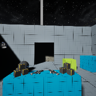

# Project Name  MDEV1003VR_Starter

## Description

A github repository for the in class demonstration code to develop VR application and allow testing on non-VR screen/laptop.    
 
## Usage
Clone, or download the zip, to a local directory. Open in Unreal Engine 5.4 or newer

## Attributions
1) Based on video by Stephan Anemaat, ( https://youtu.be/k-nlcAYXMW0 )
2) editor splash screen logo by Georgian
3) glow stick and flashlight by S Benoit, ( https://sketchfab.com/scbenoit/models )
4) Bench by Nicolas 3D, ( https://sketchfab.com/3d-models/bench-model-free-5d5f3851a1e5448cb8728ebc5df5ee93 ) 
5) Background Music - Protesting Robot by Michieal Ramir C, ( https://mixkit.co/free-stock-music/discover/protesting-robot/ )
6) Bubble pop sound from pixabay, ( https://sketchfab.com/3d-models/bench-model-free-5d5f3851a1e5448cb8728ebc5df5ee93 )
7) Maze Generation: https://www.mazegenerator.net/
8) Dog: By Stylo ,(https://www.fab.com/listings/b8a2a0cb-2ce5-461d-ac95-a207dc176395)
9) Health power up symbol: "Heart" (https://skfb.ly/oOYT6) by farooq.smurf is licensed under Creative Commons Attribution (http://creativecommons.org/licenses/by/4.0/).
10) Human Character: By SebastianBA , (https://www.fab.com/listings/ebdc8829-9e41-4e1f-bf50-3ae6605ccca1)

